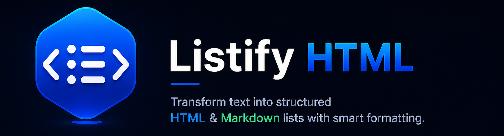

<div align="center">



# Listify HTML

**Convert selected text into clean HTML or Markdown lists — instantly.**

[](https://marketplace.visualstudio.com/items?itemName=swarupdhavan.listify-html)
[](https://code.visualstudio.com/)
[](#license)
[](mailto:swarup93@proton.me)

<br/>

<!-- for recorded demo -->
<!--  -->

</div>

---

## What It Does

Select any text. Right-click. Get a perfectly formatted list.

Listify HTML handles the messy real-world cases — already-prefixed lines, comma-separated values, indented nested structures, mixed bullet styles — so you never write repetitive `<li>` markup by hand again.

---

## Features

<table>
<tr>
<td width="50%">

**Core**
- `<ul>` and `<ol>` HTML list generation
- Markdown list generation (`-` / `1.`)
- Newline-separated input
- Comma-separated input (`a, b, c`)
- Nested lists via indentation

</td>
<td width="50%">

**Smart**
- Auto Mode detects list type from prefixes
- Strips numbering & bullets in Auto Mode
- Preserves original text in Manual Mode
- Reverse conversion: HTML list → plain text
- Matches editor tab/space settings

</td>
</tr>
</table>

---

## Usage

**Via right-click menu** (appears only when text is selected):

```
Right-click → Listify HTML: Generate List
Right-click → Listify HTML: Reverse List
```

**Via Command Palette** (`Ctrl+Shift+P` / `Cmd+Shift+P`):

```
> Listify HTML: Generate List
> Listify HTML: Reverse List
```

Then pick your **list type** → pick your **output format** → done.

---

## Examples

### Newline input → HTML list

```
Apple          →    <ul>
Banana         →      <li>Apple</li>
Cherry         →      <li>Banana</li>
               →      <li>Cherry</li>
               →    </ul>
```

### Comma input → HTML list

```
red, green, blue   →   <ol>
                   →     <li>red</li>
                   →     <li>green</li>
                   →     <li>blue</li>
                   →   </ol>
```

### Auto Mode — strips existing prefixes

<table>
<tr><th>Input</th><th>Output</th></tr>
<tr>
<td>

```
1. Download the installer
2. Run setup.exe
3. Follow the prompts
```

</td>
<td>

```html
<ol>
  <li>Download the installer</li>
  <li>Run setup.exe</li>
  <li>Follow the prompts</li>
</ol>
```

</td>
</tr>
<tr>
<td>

```
- Open the file
* Select all text
• Copy to clipboard
```

</td>
<td>

```html
<ul>
  <li>Open the file</li>
  <li>Select all text</li>
  <li>Copy to clipboard</li>
</ul>
```

</td>
</tr>
</table>

### Nested lists (indentation-based)

<table>
<tr><th>Input</th><th>Output</th></tr>
<tr>
<td>

```
Fruits
  Apple
  Banana
Vegetables
  Carrot
```

</td>
<td>

```html
<ul>
  <li>Fruits
    <ul>
      <li>Apple</li>
      <li>Banana</li>
    </ul>
  </li>
  <li>Vegetables
    <ul>
      <li>Carrot</li>
    </ul>
  </li>
</ul>
```

</td>
</tr>
</table>

### Reverse conversion

```html
<!-- Selected in editor -->        <!-- Replaced with -->
<ul>                               First
  <li>First</li>          →        Second
  <li>Second</li>                  Third
  <li>Third</li>
</ul>
```

---

## Auto vs. Manual Mode

| | Auto Mode | Manual Mode (`ul` / `ol`) |
|---|---|---|
| Detects list type | ✓ from existing prefixes | — you choose |
| Removes `1.` `2)` `3-` prefixes | ✓ | — text kept as-is |
| Removes `-` `*` `•` prefixes | ✓ | — text kept as-is |
| Handles mixed prefix styles | ✓ | — |

**Auto Mode detection rules:**

| Prefix pattern | Detected as |
|---|---|
| `1.` `2.` `3.` or `1)` `2)` | Ordered list |
| `-` `*` `•` | Unordered list |
| No recognisable prefix | Unordered (default) |

---

## Settings

Search `Listify HTML` in VS Code Settings (`Ctrl+,`):

| Setting | Options | Default | Description |
|---|---|---|---|
| `listifyHtml.defaultFormat` | `html` / `markdown` | `html` | Pre-selected format in the prompt |
| `listifyHtml.defaultListType` | `ul` / `ol` | `ul` | Default list type |

```jsonc
// settings.json
{
  "listifyHtml.defaultFormat": "markdown",
  "listifyHtml.defaultListType": "ol"
}
```

---

## Development Setup

```bash
# Clone and install
git clone https://github.com/your-username/listify-html.git
cd listify-html
npm install

# Open in VS Code and press F5 to launch the Extension Development Host
code .
```

```bash
# Package as .vsix
npm install -g @vscode/vsce
vsce package

# Install locally
code --install-extension listify-html-1.0.0.vsix
```

**Project layout:**

```
listify-html/
├── extension.js       ← main logic
├── package.json       ← manifest & commands
├── images/
│   └── icon.png       ← 128×128 PNG icon
└── .vscode/
    └── launch.json    ← F5 debug config
```

---

## Contributing

Bug reports and pull requests are welcome.

- Follow the existing code style (ES6+, modular JavaScript)
- Keep pull requests focused — one fix or feature per PR
- Test against the edge cases in the [Auto vs. Manual](#auto-vs-manual-mode) section

**Contact:** Swarup Dhavan — [swarup93@proton.me](mailto:swarup93@proton.me)

---

## Usage Restrictions

The source code, logic, and feature design of this extension are the intellectual property of the author. You may **not** copy, reproduce, or reuse any part of this codebase — in whole or in part — in your own projects or tools without explicit written permission.

Forking to submit pull requests is permitted. Forking to build a derivative product is not.

To discuss licensing, contact [swarup93@proton.me](mailto:swarup93@proton.me).

---

## License

Proprietary — All rights reserved by **Swarup Dhavan**.

---

<div align="center">
<sub>Built by <a href="mailto:swarup93@proton.me">Swarup Dhavan</a></sub>
</div>